# Welcome to Object Utility Nodes Extension

The **Object Utility Nodes Extension** is a versatile toolkit includes a variety of nodes for diverse purposes. 

You'll find some simple and one complex node which can be used to set material colors for different objects with harmonic colors which is described for example [here](https://blog.thepapermillstore.com/color-theory-color-harmonies/).

## What's inside the Extension?

This project consists of three main modules:

### 1. **ccn_utils**
This module provides a framework to create custom node editors and integrate node classes. This is used to create the Custom Node Editor, the menu entries and the linking of the nodes into it.

### 2. **Object Utility Nodes**
The Object Utility Nodes module introduces a collection of general-purpose, easy-to-use nodes designed for practical workflows. These nodes serve as useful tools for getting values from an existing object in the scene, for supplying calculations, numbers and colors and to assign it back to the objects in the scene (which don't need to be the same).

### 3. **Color Harmony Node**
The Color Harmony Nodes module offers advanced functionality for generating and exploring harmonic color schemes. Perfect for artists and developers seeking inspiration in color theory. You can use it to select a base color, a harmony type and you will get up to four output colors which you can assign to target objects.
The color wheel is shown directly in the node and lines and color markers are shown on the color wheel for orientation.

It was made from an idea explained [here](https://www.skool.com/cgpython/looking-for-a-brainstorming-crew), where I created this as a "N" menu sidepanel but more to show if it is possible in general but this addon there has very limited use other than to extend it with own programming (it creates the colors but the addon had no way to assign them anywhere).

Reprogrammed that here as node which allows you to assign the generated colors to an object in the scene as material. And of course you can use more than one harmonic color wheel also and use their output as input for another harmonic color node for example.


---

In the next sections, you'll find step-by-step guides on installing and utilizing this extension effectively. 

**Let’s get started!**

## Details about the Modules

### 1. **ccn_utils**

Inspired by the idea of simplifying custom node creation, **ccn_utils** was developed to address these challenges and make custom node editors accessible using Python. Here’s what it offers:
- Easy setup of custom node editors.
- Effortless integration of custom node classes into the editor.
- A convenient way to create node categories and assign node classes to them using a simple dictionary-based structure.
But this is not meant to be a replacement for the Blender API or meant to be an official extension of it, it's just used here in this extension to make the rest of the code easier.
You can use it in your own projects if you want but you need to adjust it in case that the Blender API ever changes.

### 2. **Object Utility Nodes**

The **Object Utility Nodes** module provides a collection of versatile and general-purpose nodes tailored for common Blender workflows. These are mainly helper nodes to have a way of assigning values from or to objects in the 3D scene and to provide or get values using the Harmony Color Node.
This module includes nodes that handle basic operations, such as selecting objects, manipulating numeric values, generating colors, and managing outputs.

#### **What’s included?**
This module contains various node classes grouped into categories inside the "Add" menu of the node editor, making it easy to build node-based workflows for a range of tasks. Here are the key features:

- **Math Nodes:** Perform numeric operations and calculations.
  - **Number Node**: The simplest node of all: You can enter a float number and use it as output.
  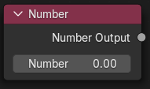
  - **Dynamic Input Node**: Also a very simple node which adds all input float values or multiplies them, as two output sockets. The special thing here is that you have a button which allows you to add more inputs. The number of input sockets can be increased, but not reduced. You would need to remove it and reinsert it if you need less input sockets.
  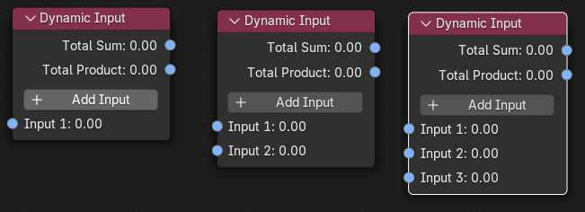
  - **Number Operator Node**: This is for basic math operations for adding, subtracting, multiplying and dividing input numbers and output the result as one output socket.
  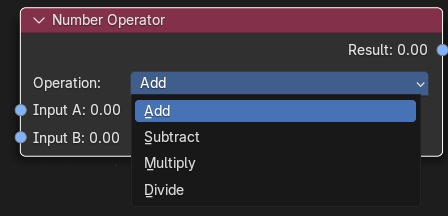
- **Object Nodes:** Select objects and define object targets for interactions.
  - These nodes are to operate with the displayed 3D scene. You can select an object and get some base values like position or scaling and the target node can be used to assign these values and additionally a color to a target object in the scene. Material will be automatically created if it doesn't exist. (Don't forget to switch the view in "Viewport Shading" (right upper corner of the 3D editor) to "Material Preview" to see the colors.)
  - **Object Selector Node**:
  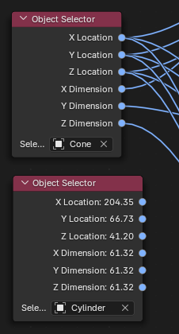
  - **Object Target Node**:
  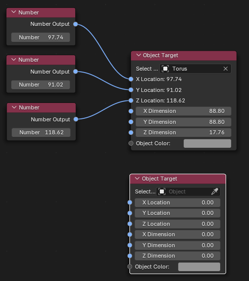
- **Color Nodes:** Generate and manipulate colors dynamically.
  - **Color Generator Node**: This was originally a dummy to create color values before I added the second one (see below). I left it here so you can see how you can reach color manipulations without complex code. It creates a complementary color for a given base color and outputs both.
  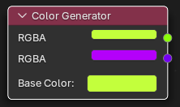
- **Output Nodes:** Manage outputs effectively in your node editor.
  - **3D View Output Node**: Was created to have a quick way to see a value result with a label as inserted text and result value as text in the 3D scene. Label and result value both have colors also available as input sockets. Together with the Number Operator Node above you can i.e. create a simple calculator with it with direct updates in the 3D scene if you change the input numbers. It has X/Y/Z-Positions which can be linked to an object's X/Y/Z-Positions and additionally Offsets for X/Y/Z. You can use this to create i.e. a measurement label to an object. If you then switch the object in the object selector node the complete measurement labels you linked to it will "jump" to the new object - with the values updated of course.
  
  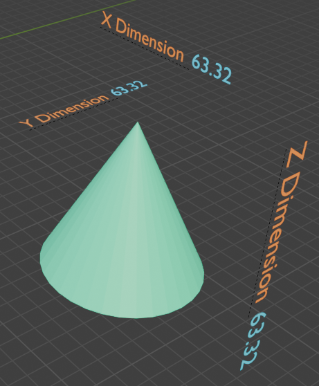
- **Utility Tools:** Includes nodes for updates and workflow management.
  - **Update Node**: This contains a "Refresh Tree" button. As it is very difficult in Blender to provide automatic updating when changing values in the nodes (at least for me...) I added a simple button which starts a complete update process for all inserted nodes. So if anything is not updated, try to click the button. I'm sure there will be better ways of updating nodes, but feel free to integrate it in your code.. :)
  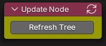

### 3. **Harmony Color Node**
The **Harmony Color Node** is a versatile tool designed to generate harmonic color palettes and creative color designs. This node provides an intuitive and flexible way to dynamically manipulate colors in Blender workflows, producing visually appealing results.

#### **What does the Harmony Color Node offer?**
- **Harmonic color combinations:** Generate colors based on different color harmonies such as complementary colors, triads, and analogous palettes.
- **Dynamic control:** Easily manipulate the base color, angle, and color space for flexible adjustments.
- **Interactive visualization:** Visualize the generated colors directly in the node as a color wheel with color markers, angle guides, and help lines. These visual aids make it easier to grasp the relationships between the colors.
- **Direct application:** Use the harmonized colors as material color values for objects in the 3D scene.

#### **Features in detail**
#### **Set a base color:**
   - Choose a base color in either the RGB or HSV color space. This serves as the starting point for generating harmonic colors.
   - Use an additional node, like the Color Generator node, to externally control or dynamically adjust the base color.
#### **Select a color harmony:**
   - **Complementary**:
        A color and its opposite on the color wheel
   - **Split Complementary**:
        Two colors adjacent to the complementary color for more variety
   - **Analogous**:
        Colors adjacent to each other on the color wheel for a harmonious look
   - **Triadic**:
        Three evenly spaced colors on the color wheel
   - **Tetradic Square**:
        Four colors evenly spaced, forming a square in the color wheel
   - **Tetradic Angle**:
        Four colors forming a rectangle on the color wheel, offering subtle balance
   - **Monochromatic**:
        Variations of a single color for a clean and cohesive aesthetic

Sample for Tetraedic Angle:
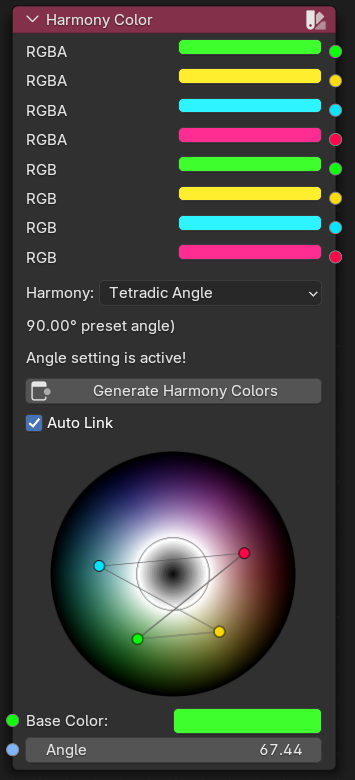

#### **Dynamic updates:**
   - Changing the base color, harmony mode, or angle will immediately recalculate the colors, enabling seamless previews and adjustments in real-time.

#### **Angle customization:**
   - For certain harmony types, the angle can be individually adjusted to fine-tune the output. The default angle values are displayed as visual aids in the node, and adjustments can be made either manually or via linked nodes.
   - When a new harmony type is selected, the displayed preset angle will be used instead of the angle in the angle property. If you want to use the angle from the property you need to change the angle value at least one time. This is to show the correct result of the chosen color harmony - because always using the value from the property would create the same result for different harmony types as depending on the chosen angle you can make i.e. an analogous harmony from a triadic one and so on.

#### **Inputs and Outputs**
- **Inputs:**
  - *Base Color:* The primary color used as the basis for calculations.
  - *Mode Selection:* Choose between various harmony modes.
  - *Angle:* (Optional) Input for adjusting the custom angle dynamically via a linked node.
  
- **Outputs:**
  - *Harmonized Colors:* Outputs the generated color combinations as RGBA and additionally as RGB values (fixed Alpha of 1.0), ready for use in material designs, texture creation, or procedural workflows.
  - The first output color is always the chosen base color
  - Depending on the chosen harmony 2, 3 or 4 colors are generated. If you choose for example "complementary" as harmony, output 1 is the base color and output 2 the complementary color. Colors 3 and 4 remains unchanged so if a previous harmony choice has created a color here you can still use it as output but the color has nothing to do with the harmony "complementary" here.

- ** Additional functions: **
  - This as the only node here can be inserted into the standard Shader Node Editor.
  - As Blender seems not to be able to use the Python output as input for a Shader Node color an additional button "Generate Harmony Colors" is available. This creates four standard Shader RGB Nodes using the four harmony colors and groups them into a frame.
  - If you click "Auto Link" the four colors will be linked to four settings of the material, beginning with the Base Color. Others are Specular, Coat and Emission. Without "Auto Link" checked you can recreate the colors clicking the button again so you can remove the links you do not want and adjust the colors without relinking them again. Of course you can use the colors after inserting wherever you want in the Shader Node Editor as they are native Blender nodes.
  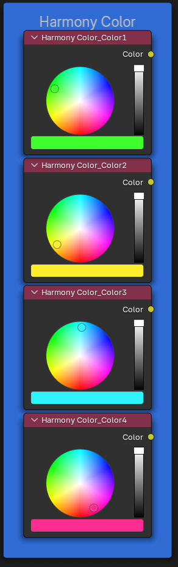

#### **Use Cases**
- **Material design:** Quickly create harmonious color palettes for shaders and materials.
- **Graphic design:** Develop color schemes for animations, promotional graphics, or rendered scenes.
- **Visualization:** Show harmonic relationships directly in the node editor and visualize them in the 3D scene for better understanding.

#### **Tips and Tricks**
- Link a **Color Generator** to the *Base Color* input for a more organized node layout, keeping the Harmony Color Node focused on calculations. When you open the color dialog it will not overlap the color wheel and you can directly see the result.
- For **advanced workflows**, connect additional nodes to the *Angle* input to dynamically adjust the relationships between colors.
- Of course **more than one node** is always possible, so you can create two or more harmony color nodes and use their output as base color input for another. With that you can mix harmonies like you want.
- Using the **object target node** you can also change more than one object, for example by creating 4 objects and assign each one color of the harmony color output. You can add a number node and assign it at the same time to the angle input and also to a dimension or position input of the object target so if you change the number an object can move/resize and at the same time change it's harmony colors.

---
# **Lessons Learned: Developing Blender Extensions with Visual Studio Code**

Creating Extensions for Blender comes with unique challenges, especially when working in combination with Visual Studio Code. This section summarizes key insights and solutions to streamline your workflow and avoid common pitfalls.

## **Useful Links To Start**
  - Blender has a short explanation about creating extensions in general on the [documentation page as introduction](https://docs.blender.org/manual/en/latest/advanced/extensions/getting_started.html)
  - Victor Stepanov has a bundle of great Blender/Python videos and one of it explains how to set up the [free Microsoft code editor "VSCode"](https://code.visualstudio.com/download) in conjunction to Blender and Python. The video can be found [here](https://www.youtube.com/watch?v=YUytEtaVrrc).

## **Setting Up Your Environment**
1. **Using Visual Studio Code for Blender Development:**
   - Install the **Blender Development Addon** to enable direct integration with VSCode. This addon simplifies the process of starting Blender with your extensions and debugging your scripts. Follow the steps of Victor's video above.
   - After successfully installing the Addon you need to start Blender by using the ">Blender: Start" command at the top of VSCode. This makes sure that you can start your script with ">Blender: Run Script" which then gives you the possibility to set breakpoints in your code and single step through the code. This is not possible with the Blender internal script editor.
   - If you just want to start some scripts and experiment with Python in Blender, that's the best way to do it.
   - If you want to develop a real extension (formerly add-on) you need to set up a bit more, see the next section.

2. **Correctly Structuring Your Extensions:**
   - Ensure your extension folder contains an `__init__.py` file. This is required for Blender to recognize your extension as a Python module.
   - Follow Blender’s strict naming conventions for imports:
     - Use **`from .`** for relative imports.
     - Avoid manipulating `sys.path` as this violates Blender extension requirements.
   - Ensure the folder contains a `blender_manifest.toml` file. Older descriptions for addons contains information about a bl_info structure inside of your code which is deprecated. Same is true for `extension_manifest.json` which is also no longer needed for an extension in Blender. The current one is `blender_manifest.toml` which is described in the explanation link in the above section about links to start with.
     - Important: You need to include all "required" entries described there, otherwise your extension will not be recocgnized or you get error messages when you look into the Blender preferences. If everything is OK, your extension should be listed under "Get Extensions" and not under "Add-Ons" there.
   - I recommend to keep all Python files in the same folder without subfolders.
   - If your extension needs any external library it's required to package them into a folder `wheels` and add that to your manifest file. Here is the [description](https://docs.blender.org/manual/en/latest/advanced/extensions/python_wheels.html) how you need to do that.

3. **Reloading Extensions During Development**
   - **Challenges:**
     - In opposite to starting single Python scripts using the ">Blender: Run Script" command mentioned above you cannot use that after you have added the `__init__.py` and the `blender_manifest.toml` files. The Blender addon recognizes automatically that your project is now an extension and you cannot start the files as usual because the addon automatically registers your extension as extension in Blender.
       - If you look into "Get Extensions" in Blender's Preferences you'll find "Repositories" at the top right corner. Here is now a new one called "vscode_development" where the addon temporarily registers your extension.
       - Once loaded, Blender keeps extensions active within its Python interpreter, making it tricky to test changes dynamically.
       - If you try to start `__init__.py` manually leads to errors like `ImportError: attempted relative import with no known parent package`.
       - Fortunately the Blender addon has a solution to restart your extension using the command: ">Blender: Reload Addons". This will unregister your extension from Blender and register it again like as if you would have deinstalled and installed the extension with a zip file manually.
       - Keep in mind: Blender will keep the old code for already inserted nodes (if you develop a node extension like this here). So changes you made can lead either to "unknown ..." message on existing nodes (which are colored red then) or you simply see the old state of the node. To test your changes, you need to insert a new node of the same type where you will see the changes.
       - Be careful when you use Undo in Blender. It seems the registration the Blender development addon performs is also what Blender adds to the undo list. If you use Undo it can therefore happen that Blender crashes completely while still connected to VSCode. So better avoid using Undo - and save your Blender file often if you still want to use it later.

4. **Managing Imports, Variables, Classes, Node Updates**
   - **Relative Imports:**
     - Always use `from .` for relative imports in the extension scripts to ensure compatibility with Blender’s module handling.
   - **Instantiation of classes:**
     - In opposite to normal Python classes where you can use an `__init__` function in a class and where you usually initialize class variables with "self.variable =..." you can't use that in case of node classes.
     - Blender has it's own way of handling the node classes, with predefined function names like "init" (without underscores) which must be used instead.
     - If you try to create a class variable using "self." you'll see that they are not persistent. Next time you call the function they are not existent, so I guess whenever Blender need to start a node class it instantiates it as new and then your own variables are lost.
     - So if you want to use persistent variables the only way is by using global variables or by creating a Blender property inside the class. This you can access with "self.myvariable". You can expose such variables using the "draw_button" method as a node input variable (but don't need to be an input or output socket). As Blender always saves such properties together with the current Blender file the values of these properties are always persistent.
   - **Avoiding Global Variables:**
     - If you need persistent values across multiple instances of nodes, then use class properties as described above.
     - If you want to have temporary variables being accessible from all nodes you could use global variables, but always make sure that if you need them for a node, each node type can be inserted multiple times so you can't use individual values for each node of the same type.
     - Another possibility is to create a class containing general Blender properties which will be also persistent by saving the Blender file. These values could be used by different nodes like global variables.
   - **Updating nodes:**
     - Blender doesn't provide an automatic node updating when you change input or output socket values (or I didn't found out how). But Blender properties have an attribute "update=" where you can specify an update function which should be called whenever a Blender property has been changed.
     - You can use either a global function or you can use a lambda function which can call a class function of the same class.
     - Here is an example from the current extension using a lambda function:
     ```
      class CCNCustomFloatSocket(NodeSocket):
          bl_idname = "CCNCustomFloatSocket"
          bl_label = "Custom Float Socket"

          _is_updating = False
          
          default_value: bpy.props.FloatProperty(# type: ignore
                                                name = "Value"
                                                ,default = 0.0
                                                ,update = lambda self, context: self.call_node_update(context)
                                                )

          def call_node_update(self):
              if CCNCustomFloatSocket._is_updating:
                  return
              
              try:
                  CCNCustomFloatSocket._is_updating = True
                  if self.node and hasattr(self.node, "update"):            
                      self.node.update()
              finally:
                  CCNCustomFloatSocket._is_updating = False
    
    - (hint: use `# type: ignore` to avoid warnings in VSCode)
    - always use `default_value` if you create a socket class as this is the standard for socket values
    - Blender always forwards "self" and "context" to the function in the "update" attribute. This can be used like here in the lambda function and also in a general global update function like with `update = my_update_function` where no parameter is needed. But in the `def my_update_function(self, context)` you need to specify both parameters as Blender will call the function with bot parameters although a global function usually doesn't have a "self" as it is outside of a class.
    - The example above shows how you can use a singleton class variable "_is_updating" to avoid recursive calls of the update function as long as it is already running.
    - Using an own socket gives you more control how the socket looks like and as far as I could find out the only possibility to add an update function to a socket so that it is automatically called whenever the socket value will be changed.

5. **Github, Deploying**
     - **Github repositories**
       - If you want to use Github you need of course create a Github repository which will create additional files in the folder of your extension. You don't want to have these files in your extension. That's where `blender_manifest.toml` can help you. Here you can insert a section which tells Blender which files should be excluded when you create your extension zip file. You can add a section like this to the file:
       ```
       [build]
       paths_exclude_pattern = [
         "__pycache__/",
         "/.git/",
         "/*.zip",
         "README.md",
         ".gitignore",
       ]

      - The standard folder where your extensions will be is: `C:\Users\YourUsername\AppData\Roaming\Blender Foundation\Blender\4.4\extensions` (NOT `scripts` as in some older documentations where it was an addon).
      - There you will find a folder "user_default", that's the folder where your installed extensions will be saved.
      - As long as you develop with VSCode and the Blender addon you will see an additional "vscode_development" folder here. This contains a folder with the name of your current extension while you have it started with the Blender addon in VSCode.
      - Don't worry that if you look into the folder you will see the Github files there. That's because the folder in "vscode_development" is not a real folder but a link to your development folder so it's always the most current content. So if you open the link you are there, and because of this don't delete files here because you thought you are still in a copy in AppData. You're not. :)
      - (All information here is about Windows, I cannot say what's the case in Linux or MacOS.)

     - **Creating the extension zip file**
       - Blender has a built-in method to create a zip file of your extension containing the version number and also only the files you really want to include.
       - As usually the Blender executable is not in your system's path you need to enter the full path to it.
       - Open a command window (cmd) and go with "cd" to the folder where your extension development folder is (the folder where your `__init__.py` file is).
       - Enter:
       ```
       "C:\Program Files\Blender Foundation\Blender 4.4\blender" --command extension build
       ```
       - After executing you will find the final zip file which you can install in Blender as normal extension.
       - Keep in mind: If you do that, this will be installed to the "user_default" folder and no longer into "vscode_development". If you have installed it in Blender as "normal" extension and you additionally start Blender over VSCode your extension will be registered twice with the same name as it is in two different repositories. This can maybe produce crashes. So better uninstall the "normal" extension after testing the installation if you want to go on developing.
       - **Important**: As said above, already inserted nodes using the code as it was when they were inserted to the Blender file. So if you have a newer version of your extension and try to load your Blender file which contains older version it can happen that Blender crashes. You can only open your file again if you at least temporarily uninstall or deactivate the developed extension. Then you can delete the old nodes from the file, save it, reinstall the extension and insert the nodes again. I think this will be not the case if a newer extension version has a new version number, but I didn't test that.

**Sample and Screenshot**

Here is a sample of how the included nodes can be used:
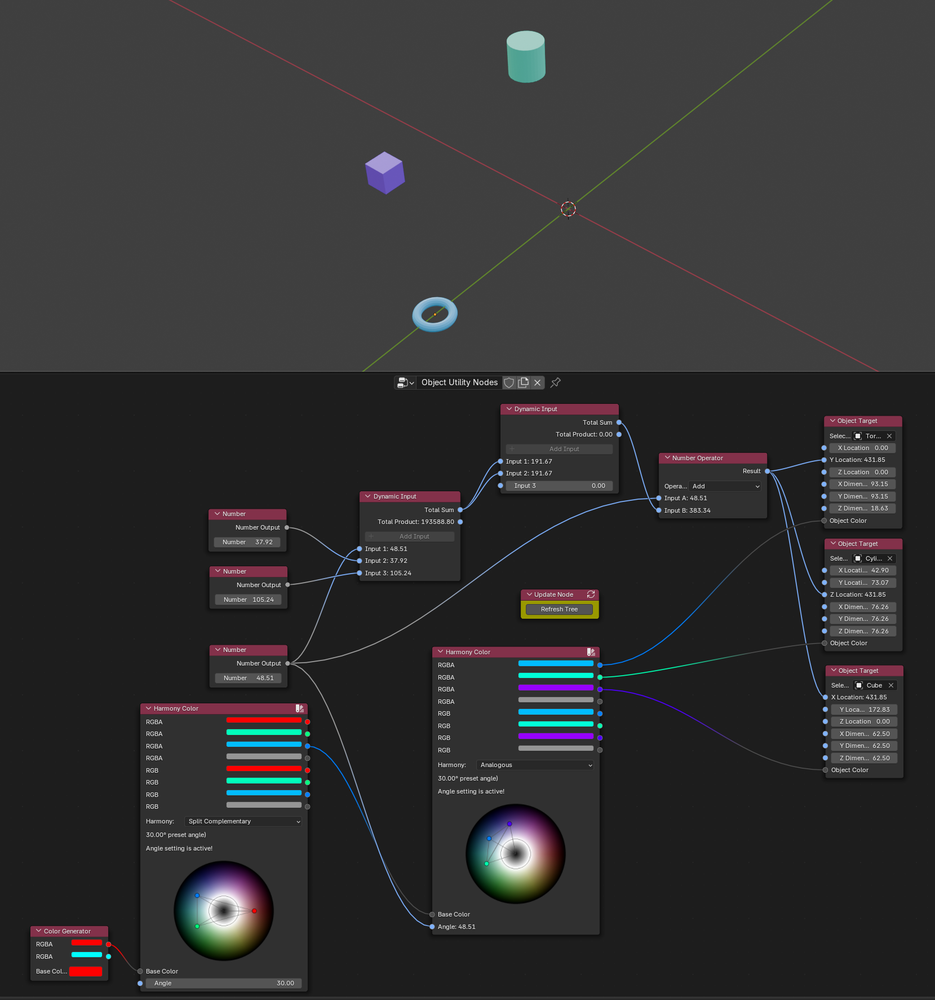

This is in the demo file `CustomNodesSample.blend`.

If you click and hold the value in the "number" node (the one directly over the left harmony color node, connected to the angle value of the right harmony color node) and move the mouse right or left you change the x/y/z positions of the three objects in the scene at the same time and you also change the angle of the right harmony color node so the effect in this sample is that you can move all three objects at the same time and the closer they get together the more similar looks their color until it's the same.

The sample is of course only to show what you can do with the nodes, it doesn't make any real sense.
